# Divergent Design in Food Reviewing

## 1. Broad Application Goals

**App Name:** Omnom

**Intended Audience:** The intended audience for this app is people in their early twenties to mid thirties who enjoy trying new restaurants, using food as a means of entertainment and maintaining social relationships.

**Value Added:** Most current food review app recommendations are not personalized, or not transparent about the recommendation process. This app will provide a more succinct, customizable way of getting more restaurant recommendations that are relevant and high quality, as well as providing a detailed personal database for users that they can reference in the future or share with a close-knit community of other food-lovers.

## 2. Scrapbook of Comparables

### Comparable Apps

Below are a few of the main apps that I felt like had comparable functionality to Omnom. I will be using these apps to analyze their comparabel features.

1. **Beli:** a food ranking app that is catered towards a foodie audience
2. **Strava:** a fitness app that allows users to share the workouts they do
3. **Yelp:** a food review app that relies on crowdsourced ratings and pictures

### Comparable Features

1. **Beli Lists:** How do we create similar functionality that users can refer back to, but perhaps is more intuitive to access?
   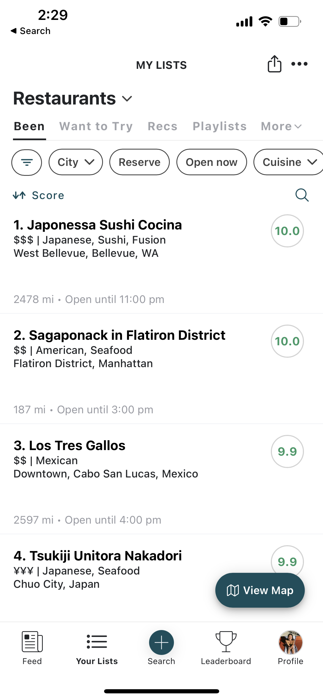
   There are a lot of different features on the Beli list page that appear overwhelming rather than useful. Plus, there is a lot of repetitive information, as seen in the screenshot below. How can we minimize clutter without losing functionality?
   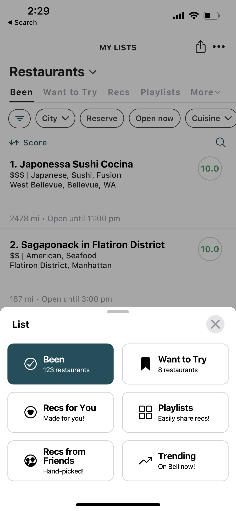
   How can we emphasize the more useful features, such as being able to filter restaurants by city?
   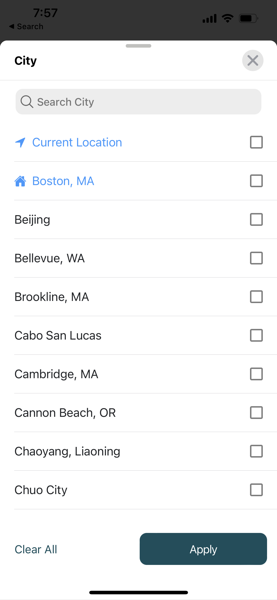
2. **Yelp Previously Reviewed:** Similar to Beli Lists, but worse. Not very easy to find the restaurants you've previously reviewed, so discourages the user from using the app as a personal reference. In Omnom, we would want to ensure that previously reviewed restaurants are easily and clearly accessible to encourage people to use it.
   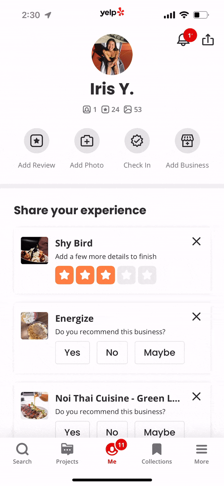
3. **Beli User Page vs Strava User Page:** How can we find a good balance between adding different features to a user's page without it looking cluttered?
   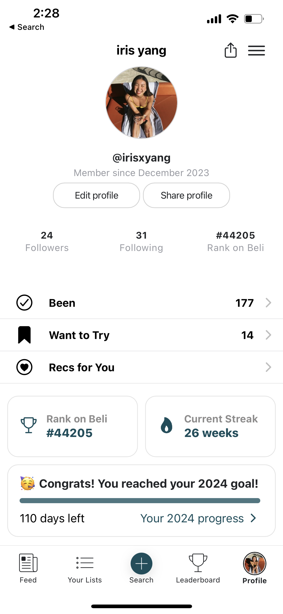
   Beli has a lot of information on their user page, and is not the most intuitive design. In contrast, the Strava user page is simple, but is not as engaging since the information is extremely limited.
   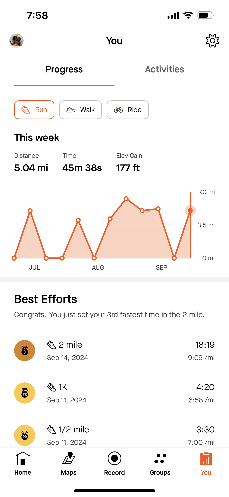
4. **Strava Main Feed:** How can we ensure that the home feed has clear headlines and visuals so that users can easily grasp the content of each post? Looking at each post on Strava, the user is easily able to tell the type of workout, the route, and any other descriptions. How can we apply these to the characteristics users look for in restaurants?
   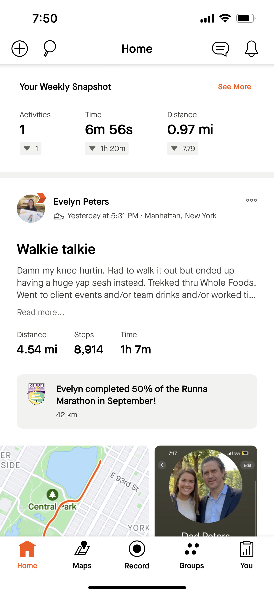
5. **Beli Restaurant Page vs Yelp Restaurant Page:** How can we concisely convey the pertinent information on a single restaurant page? I like that Beli's restaurant page has the location information in the background. However, I wish it was more clear on the actual distance between the restaurant and my current location.
   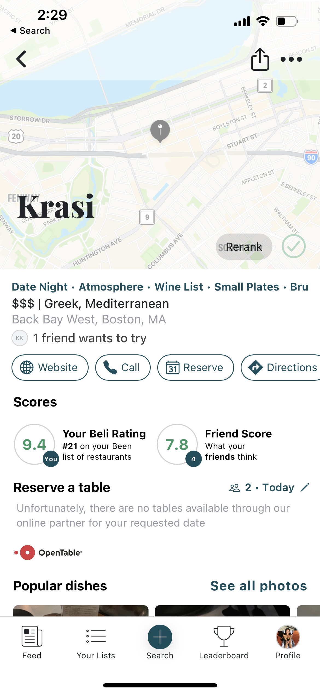  
   In contrast, we don't see location information as easily on the Yelp page. However, we can more clearly see the rating, as well as any pictures.
   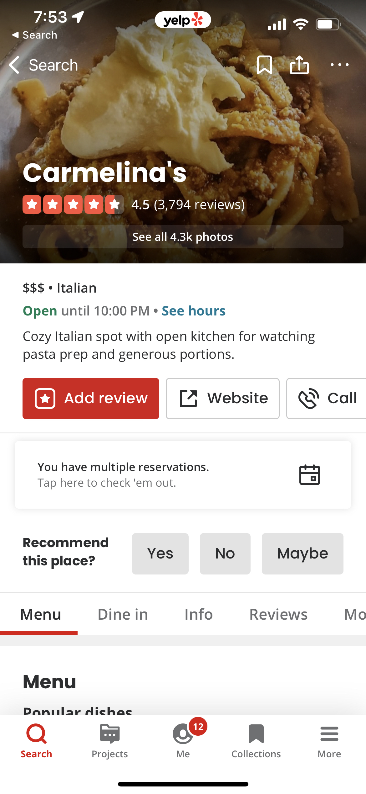
   Both restaurant pages appear to be kind of cluttered. How can we extract the essential elements while still keeping the page maximally informative?

## 3. Feature Ideas

1. **Personal Ranking:** Users will be able to see an overall ranking of the restaurants they have tried and reviewed. They will also be able to filter these results based on city, cuisine, and other characteristics.
2. **Personal Lists:** Users will be able to create and name unranked lists of restaurants based on any criteria they want. For example, they could create a list for personal favorites, or a list for late-night restaurants.
3. **Scout Status:** A select group of users that are more widely publicized across the app. These "scouts" will be selected based on the number of restaurants they review, and the quality of their reviews. This will bring value to users because their friends may not have tried as wide of a variety of locations, so the role of a Scout is to act as a baseline reference for recommendations for more restaurants.
4. **Criteria-Based Ranking:** Instead of just having one singular overall rating for restaurants, users will rank restaurants based on a couple of predetermined criteria--for example, "Service," "Food," "Ambience." The overall rating will thus be an average of these predetermined criteria, which allows for a more detailed review.
5. **Personal Palate:** A customizable weighted ranking feature that allows users to sort through restaurants that have been ranked by their friends, but weighted by their own personal preferences. This is closely tied to the Criteria-Based Ranking feature. Users will be able to choose weightings for each predetermined criteria, and results will thus be ordered based on the new weighted averages. This allows each user to have a more customized recommendation and feed experience. For example, if a user does not care about service at all, they can set the weight for "Service" to zero, and the overall average score for each restaurant will not take into consideration other users' service scores.
6. **Shared Lists:** Users will be able to create lists that can be accessed by multiple other users. This allows for connection and collaboration in between users, and encourage the social aspect of dining out.
7. **Joint Reviews:** Users will be able to create joint reviews with other users if they tried a new restaurant together. This also encourages the social aspect of dining out and helps foster a community within the app.
8. **Location Information:** Each restaurant page will clearly have location information. Users will also easily be able to see the distance to a restaurant on the restaurant's page, so that they can easily make a decision on whether a restaurant is convenient to try, or if it is a bit more out of the way.
9. **To-Try Lists:** Users will have a specific section of their lists that are "bookmarked" restaurants, i.e. restaurants that they see while browsing on the app and would like to try.
10. **Bias Adjusted-Score:** The app will show a bias-adjusted score for a restaurant that takes into account the current user's preference and reviewer's preferences. For example, if one user really likes seafood, they might score the restaurant high compared to other cuisines. However, another user might not like seafood, which means that even if it is a good seafood restaurant, they would overall still rate it lower.
11. **"Find Restaurants Near Me":** The app will have specific button near the search feature that directly finds restaurants that are close by. This is specifically for users who are trying to look for a quick bite to eat, so they can clearly see restaurants in a small radius near them.
12. **Recommendation Reasoning:** The app will have more transparency on the algorithm behind a recommendation, instead of simply just recommending a restaurant. Users will be able to see more detailed information, such as "You tend to like this cuisine with high reviews from these users." This allows the user to make a more informed decision about acting on recommendations without having to do extra research.
13. **Dish Descriptions:** Users will be able to create a sub-list of dishes ordered at a specific restaurant, and write out descriptions or reviews of each dish. This is extremely useful for users who are returning to restaurants and forget what they liked or didn't like before.
14. **Notes:** Users will be able to add overall notes to a restauarant that are more general than dish reviews, such as comments on the experience itself or miscellaneous highlights that might not be dish-specific. This gives the user more flexibility in their restaurant reviews and allows them to be more detailed.
15. **Origin-Based Rating Scale:** Instead of having a 5-star rating scale, the rating scale for the app will be based on whether it is better or worse than a baseline rating of 0 (where 0 corresponds to an "acceptable" rating--not great, but not bad), and extend from -5 to +5. This will allow a more accurate distribution of ratings compared to other apps that use a 5-star scale, since people tend to use different star ratings as "average," which skews results.
16. **Personal Rating Criteria:** Users will be able to customize and name new criteria to rank their restaurants, which allows them to rate them on criteria that is actually relevant to them. This could include typical characteristics like "Service," but also allow for more unconventional rating types such as "Vibes" and "Texture."
17. **I'm Feeling Lucky:** The app will be able to randomly choose a restaurant out of a user-created list of restaurants (or restaurants under a specific criteria, such as distance from location), which would help when users are feeling indecisive.
18. **Graph Visualizations of Reviews:** Users will be able to quickly create a visual in graph form of a list of restaurants. They will be able to customize the axes with different characteristics, and the app will automatically plot the restaurants in the list based on the rating for each axis characteristic. This is not particularly useful, but will provide a fun way to visualize restaurant data.
19. **Week/Month/Year Wrapped:** A parody of Spotify Wrapped, Omnom could have a similar feature that summarizes the top ranked restaurants, or the most visited restaurants for the users. This could incentivize the user to continue using the app out of curiosity of seeing the compiled data.
20. **Reservation Reminders:** Omnom could add a reservation or schedule reminder function to the app, where it would alert the user near the time for a reservation at a restaurant.

## VSD analysis

### Stakeholders

- **Indirect Stakeholders:** People who do not use Omnom could still be affected by the app. For example, if a restaurant gets extremely popular on the app, it might direct a lot of traffic towards that location. This means that wait times could increase, and reservations could become scarce. This would be inconvenient to people who might be regulars at those restaurants, since it would decrease the access they have to the location. A design response that could help mitigate this effect would be to limit the number of people that can make reservations through the app, or add a restriction to the recommendation algorithm so that Omnom is less likely to recommend a restaurant that is already busy.

### Time

- **Reappropriation:** Over time, there has been increased discussion about fitness sharing app Strava as a [dating app](https://www.elle.com/beauty/health-fitness/a45676230/strava-running-app-explained/). This is because Strava brings people with a common interest in exercise together, and its photo sharing capabilities allow for a way to show more personality. It also offers an easy segue for a first date, since people can easily go on a run or a bike ride together. In the future, I can see Omnom in a similar situation. Those who are passionate for food might see Omnom as an opportunity to meet other people who have the same interests as them, and can easily plan an activity (going to a new restaurant) for a first date. This functionality can be encouraged by adding image posting and commenting functionality, or even direct messaging in the app, so that people are more incentivized to interact with other users and form connections. There could also be a user recommendation feature where Omnom can recommend other users with similar tastes.

- **Sustained Friendships:** Omnom could develop into a way of maintaining friendships and relationships with family over time as it connects people through a shared love and interest in food. This could be a way for people to continue to get updates on friends or family who may not live in the same cities. A feature that could be added that might encourage this is having shared lists with a group of other people, which would allow groups to collaborate on what restaurants they liked. Another idea is being able to send personal recommendations of restaurants to other users.

- **Adaptation:** In the future, the app might have a significant influence on consumer habits and where users are spending their money. In order to encourage better consumer habits, istead of just recommending the most reviewed restaurants or the highest reviewed restaurants, Omnom could be developed to recommend more local-owned businesses and restaurants or sustainability-focused restaurants. This would encourage people to invest more in these smaller, sustainable businesses that have a better carbon footprint and uplift local communities.

### Pervasiveness

- **Crossing National Boundaries:** If Omnom expands to international use, there may be issues with the language barrier. For example, certain restaurants in other countries may not have English names, which might make them hard to search for when typing the name. Omnom could add a feature that has restaurant searching by location on an interactive map, instead of just searching by name. This would help minimize confusion since the user is much more likely to know the location of the restaurant rather than its name (in the case that the user doesn't speak that country's language). Furthermore, it might be difficult to find restaurants that are close to a hotel location if you are not there yet. A feature that could be added to help with this would be the ability to input a reference location rather than simply using the user's current location. This would allow trip planning to be much easier.

### Values

- **Value Tensions:** If users are using Omnom to record every interaction they have with eating out, some individuals who eat out frequently may have their privacy compromised, since each restaurant's location is an indication of where the user is spending their time. This may become an issue if the user wants to use the app but does not want to reveal their location as they are doing so. A feature that could be added to mitigate this is a "hidden" post feature, where the restaurant is added to the user's personal lists, but not posted to the main feed. The app could also have profile privacy settings, where only mutual friends are able to see a user's posts.

## Storyboarding and Sketching

### User Flow 1: A Quick Bite

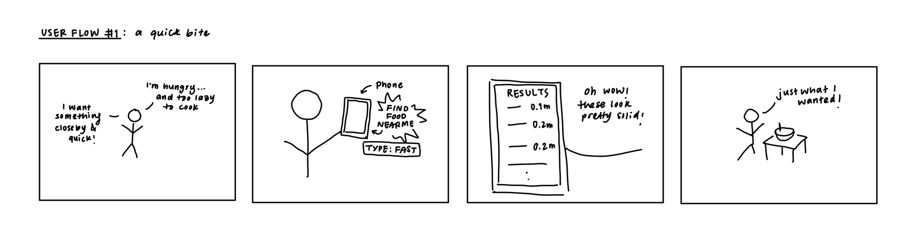

### User Flow 2: Trip Planning

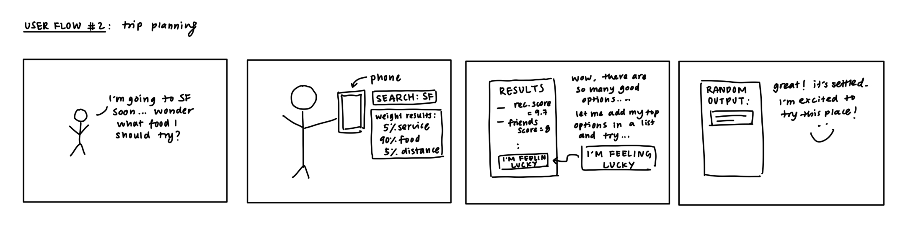

### User Flow 3: I Forgor

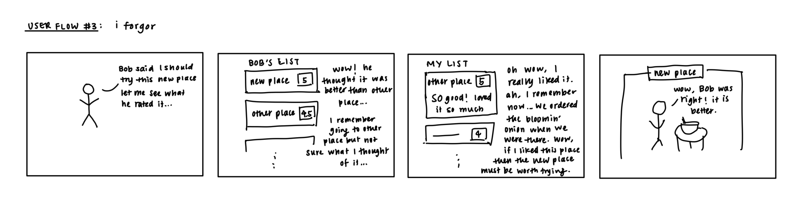
