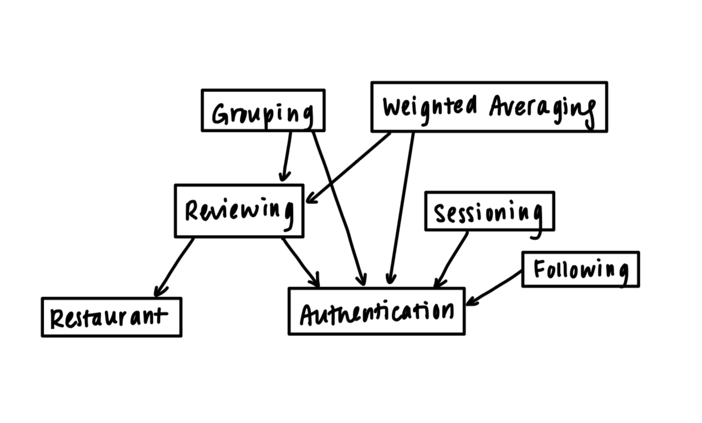
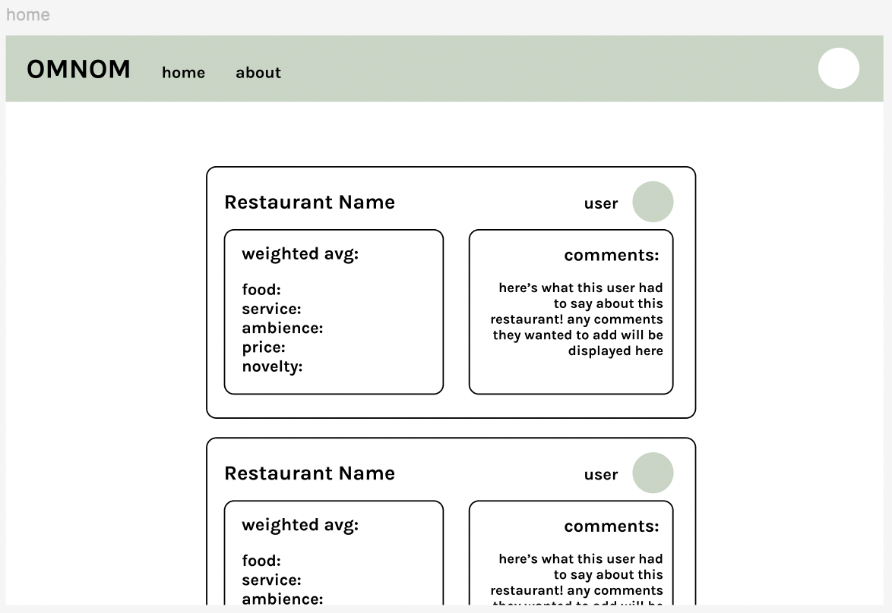
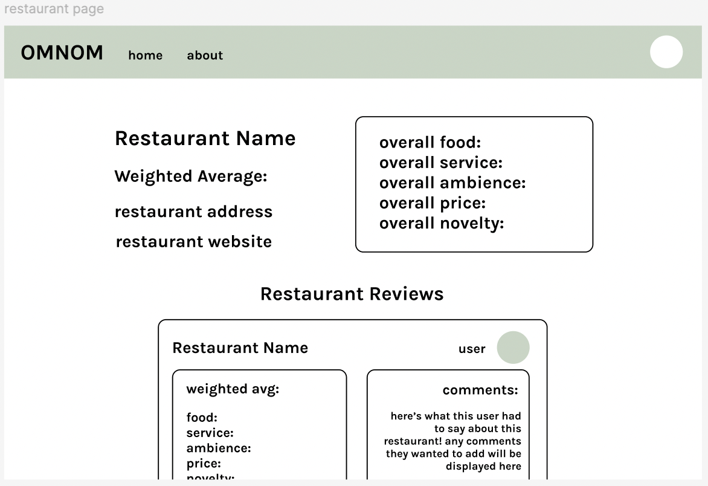
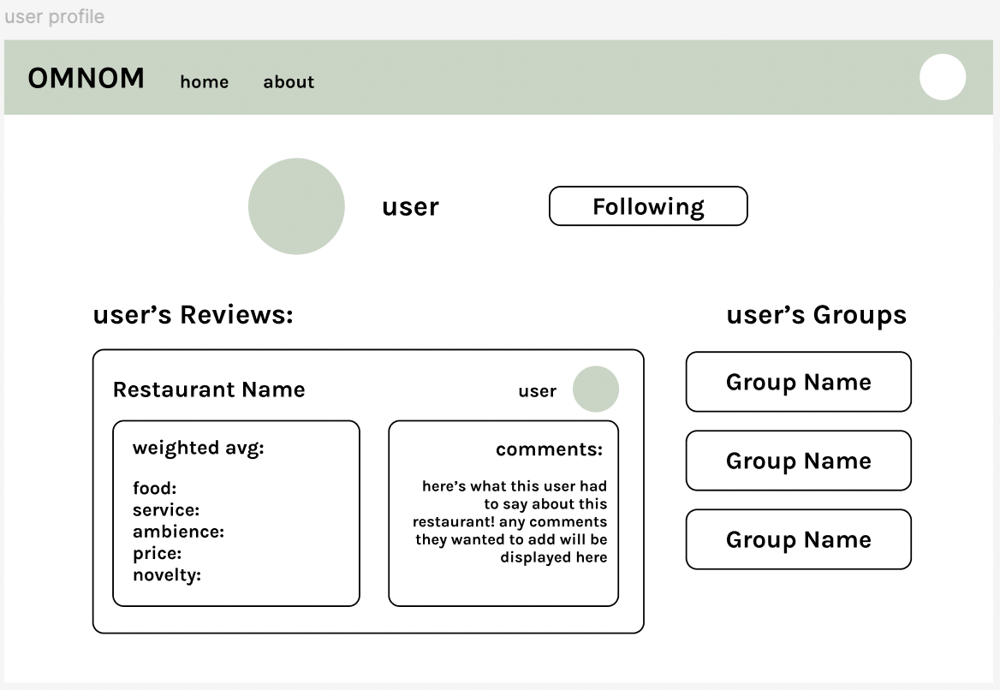
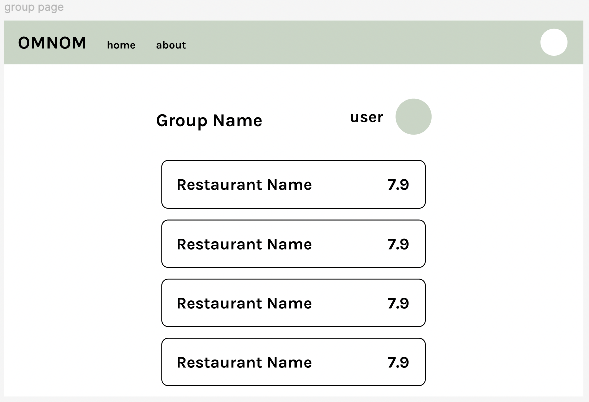

# Convergent Design in Omnom

## Pitch

Omnom is a food review app aimed towards people in their early twenties to mid thirties who enjoy trying new restaurants, using food as a means of entertainment and maintaining social relationships. Omnom will include more targeted functionality in order to provide its users with an optimized browsing and recommendation system experience. Most current food review app recommendations are not personalized nor transparent about the recommendation process, which makes it more difficult for users to get relevant, high quality suggestions. Omnom will provide a more succinct, customizable way of exploring restaurants in the area that are tailored to each user. Omnom aims to build a close-knit community of other food lovers, while also providing a detailed personal database for users that they can easily reference and navigate in the future.

## Functional Design

**NOTE:** Let Attributes refer to a universal, fixed set of Strings: (ambience, food, service, price, novelty)

### Concept 1: Reviewing

- **Purpose:** Allows users to review a particular restaurant and assign a rating to attributes, and share to that user's friends' feeds. Attributes include ambience, food, service, price, and novelty, and are rated with a value from [-5 to 5], and the overall review rating is based on an average of these attributes.
- **Operational Principle:** If someone reviews a restaurant, then the review will be shared to their friends' feeds and the user can go back later to access that review on their own profile. If the review is deleted, then it will no longer show up on the app.
- **State:**
  - reviews: **set** Review
  - restaurant: reviews --> **one** Restaurant
  - user: reviews --> **one** User
  - comment: reviews --> **?** String
  - ambience, food, service, price, novelty: reviews --> **one** Float
- **Actions:**
  - _add(res: Restaurant, ambience, food, service, price, novelty: Float, u: User, comment?: String, **out** review: Review)_ : create a review by a user for a restaurant, which includes scores for each characteristics
  - _delete(rev: Review)_ : delete a review
  - _edit(old: Review, new: Review)_ : edit a review
  - _getReviewAttributeScore(rev: Review, attribute: Attribute, **out** score: Float)_ : gets the score of a certain attribute of a review
  - _getOverallRating(rev: Review, **out** rating: Float)_ : returns the overall rating of a review based on the individual attribute scores

### Concept 2: Authentication

- **Purpose:** Authenticate users so that app users correspond to people.
- **Operational Principle:** After a user registers a username and password, they can authenticate as that user by providing the same pair of (username, password) that they registered with.
- **State:**
  - registered: **set** User
  - username, password: registered --> **one** String
- **Actions:**
  - _register(username, password: String, **out** user: User)_ : registers a username with a password as a user
  - _authenticate(username, password: String, **out** user: User)_ : confirms that a given username and password have been registered as a user

### Concept 3: Sessioning

- **Purpose:** Enable authenticated actions over a continuous period of time.
- **Operational Principle:** If a user starts a session and it is currently active, the getUser action will return the user that started the session.
- **State:**
  - active: **set** Session
  - user: active --> **one** User
- **Actions:**
  - _start(user: User, **out** session: Session)_ : start a session for a given user
  - _getUser(session: Session, **out** user: User)_ : gets the current user for the current active session
  - _end(session: Session)_ : ends an active user session

### Concept 4: Grouping

- **Purpose:** Users can group restaurants in ordered lists and label them with a name, which will be stored so that they or their friends can refer back to the list in the future.
- **Operational Principle:** If a user creates a new Group with a set of restaurants and names it, then they or their friends can access the group at any time and see what restaurants are under that group. If the user chooses a name that already exists for an existing Group of theirs, then they will be asked to choose a unique name. If the user deletes the group, then the group will no longer be stored.
- **State:**
  - groups: **set** Group
  - restaurants: groups --> **set** Restaurant
  - name: groups --> **one** String
  - user: groups --> **one** User
- **Actions:**
  - _addGroup(user: User, restaurants: **set** Restaurant, name: String, **out** group: Group)_ : creates a new group of restaurants with a name
  - _deleteGroup(group: Group)_ : deletes group given a Group object
  - _findGroup(name: String, user: User, **out** group: Group)_ : finds a group by a specified user given the group name

### Concept 5: Restaurant

- **Purpose:** Each restaurant on the app is a representation of a real restaurant and holds the basic information for that restaurant, as well as overall ratings.
- **Operational Principle:**
- **State:**
  - restaurants: **set** Restaurant
  - name, address: restaurants --> **one** String
  - website: restaurants --> **one** URL
  - reviews: restaurants --> **set** Review
- **Actions:**
  - _getRestaurant(name: String, address?: String)_ : gets a restaurant given its name, and also address if needed
  - _getRestaurantWebsite(restaurant: Restaurant, **out** url: URL)_ : gets a specific restaurant's website
  - _getRestaurantReviews(res: Restaurant, **out** reviews: **set** Review)_ : gets all the reviews for that restaurant
  - _deleteRestaurant(res: Restaurant)_ : removes a restaurant from the overall list (i.e., if a restaurant closes down)
  - _addRestaurant(name, address: String, website: URL, **out** res: Restaurant)_ : adds a restaurant to restaurants

### Concept 6: Following

- **Purpose:** Users can follow other users to be able to view the other user's Groups and see the other user's Reviews on their feed.
- **Operational Principle:** If user A follows user B, then user A can view all of the Groups that user B has made, and any Reviews that user B makes will appear on user A's feed. But, if user A unfollows user B or user B removes user A as a follower, then they will not be able to access their content anymore.
- **State:**

  - following: **set** User
  - followers: **set** User
  - user: followings, followers --> **one** User

- **Actions:**
  - _follow(curUser: User, toFollow: User)_ : allows curUser to follow toFollow
  - _unfollow(curUser: User, toUnfollow: User)_ : allows curUser to unfollow toUnfollow
  - _removeFollower(curUser: User, follower: User)_ : removes follower as a follower of curUser

### Concept 7: Weighted Averaging

- **Purpose:** Allows user to set their personal preferences on how much value they put on each attribute (ambience, food, service, price, and novelty), and thus return a weighted average overall rating for a restaurant.
- **Operational Principle:** If a user does not care whether a restaurant has good service, then they can set their preference for service to be 0. Then, when calculating the overall rating of a review based on attribute scores, getReviewWeightedAverage will return an average that puts no weight on service--i.e., the service score of that review has no effect on the weighted average.
- **State:**
  - preferences: **set** Preference
  - user: userPreferences --> **one** User
  - ambience, food, service, price, novelty: preferences --> **one** Integer
- **Actions:**
  - _setPreference(ambience, food, service, price, novelty: Integer, user: User, **out** preference: Preference)_ : sets a user preference to be the values passed in
  - _getReviewWeightedAverage(rev: Review, pref: Preference, **out** avg: Float)_ : given a review and a specified preference, will return the correct weighted average of the review's attribute scores (weighted based on preference).

### Synchronizations

- _**sync** login (username, password: String, **out** user: User, **out** session: Session)_ : user must be a valid user and authenticated before starting a new session for that user

- _**sync** logout (session: Session)_ : user logs out of session

- _**sync** deleteRestaurant (restaurant: Restaurant)_ : if a restaurant is deleted, then all Reviews of the restaurant should also be deleted, and the restaurant should be deleted from any Groups that it is a part of

### Dependency Diagram

## Wireframes

The wireframes on Figma can be found [here](https://www.figma.com/design/OH0nWkwhKvd4kPZcUkTmcJ/Untitled?node-id=0-1&t=iHC4hkTnKlapVCqx-1)

The first frame depicts the home screen, where the main feed will be displayed with all the reviews. Each review includes state described in the Review concept such as scores and comments. Clicking on the restaurant name will bring you to the respective restaurant page.

The restaurant page shows the overall user scores for all the reviews, as well as the overall weighted average. Scrolling down on the restaurant page will show all the reviews that have been made for that restaurant.

Clicking on any user name or profile picture (such as in the top right corner or the top right of any review) will take you to that user's profile page. If you are following the user, you will be able to see their reviews and all the Groups that they have made. If you are not following the user, you will only be able to see the reviews, but not the groups.

Clicking on any of the user's Groups will take you to that Group's page. The Group page is essentially just a list of restauarants with their overall ratings on the right side.

Finally, by clicking your own profile in the top right corner, you can view your own reviews, Groups, and edit your preferences. The preferences determine the weighted averages that are displayed on all other overall ratings for reviews.

## Design Tradeoffs

### 1. Friend or Follower?

My initial concern for the Following concept was that based on my current description, users can follow other users without any sort of approval process, which may be a privacy issue. The first solution that I considered was to create an request process for following, where a user can approve or decline follow requests. The second solution that I considered was to use the concept of "Friending" instead of following. This would still be implemented with an approval process, but once a user approves another user's friend request, then both users can mutually view each other's Groups and see each others' reviews on their home feed. This is essentially a "tightening" of the following concept, where the actions of following each other are tied together into one action.

My solution was actually to combine the two. The main flow of actions would still be the first solution (Following with an approval process), but I think it would be beneficial to have a "Friends" concept--i.e., people who mutually follow each other are considered "Friends." This could encourage a sense of close community within users, but still allow users to engage with others that they are not personally familiar with.

### 2. Grouping in Groups

Another design tradeoff I considered whether to only allow Groups to be created and managed by one user, or allow Groups to be managed by multiple users. For this design tradeoff, I was thinking more logistically--having multiple users managing a Group can become confusing, especially if the collaboration process is not intuitive. I would like to create Groups that are able to be managed by multiple users, because I believe that it would further help encourage a sense of community between users. I think a good solution would be to somehow apply the concept of Following to Groups (building off of tradeoff #1 above). Other than the original user who created the Group, other users can request to "follow" a Group, and if the original creator approves the user then that user can modify that Group. By applying a familiar concept like following to the collaboration process, it keeps Groups more intuitively useable.

### 3. Preference for Preferences

Finally, I considered the user flow when using the app and seeing the weighted average values for restaurant ratings. Sometimes, users might want to see an "objective" unweighted average--in which case they would have to navigate back to their profile to change their preference to an even weighting. I considered adding an unweighted average score to all reviews in addition to the weighted average. I thought that this was a good idea, allowing users to gauge how their preferences differ from the overall average. However, I didn't think this was enough, because it still did not resolve the hassle of navigating to and from the user profile if the user wanted to change their preferences. My final solution builds on my initial solution: in addition to displaying an unweighted average score on reviews, the app should also have an "easy access" panel available on every single page where the user is able to change their preferences quickly and efficiently.
