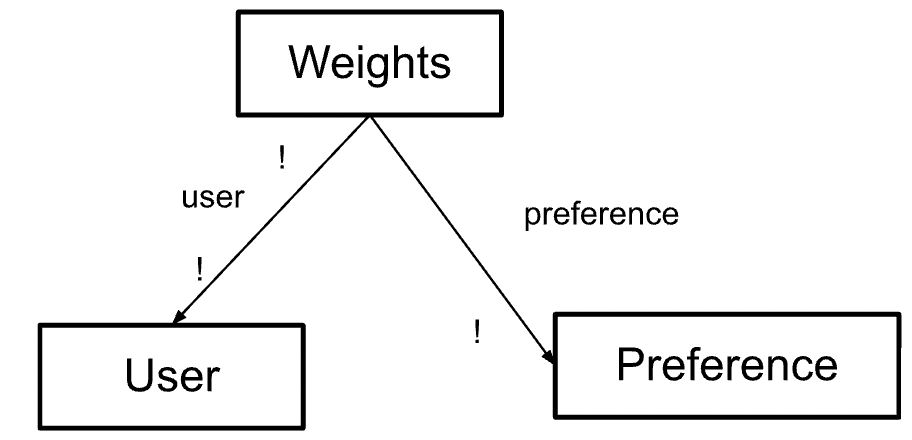

# Backend Design and Implementation for Omnom

## Links

You can find the code repository [HERE](https://github.com/irisxyang/backend-starter).

You can find the deployed service [HERE](https://backend-starter-gilt.vercel.app/).

## Concepts (Modified From A3)

### Concept 1: Reviewing [User]

- **Purpose:** Allows users to review a particular restaurant and assign a rating to attributes, and share to that user's friends' feeds. Attributes include ambience, food, service, price, and novelty, and are rated with a value from [-5 to 5], and the overall review rating is based on an average of these attributes.
- **Operational Principle:** If someone reviews a restaurant, then the review will be shared to their friends' feeds and the user can go back later to access that review on their own profile. If the review is deleted, then it will no longer show up on the app.
- **State:**
  - reviews: **set** Review
  - restaurant: reviews --> **one** Restaurant
  - user: reviews --> **one** User
  - comment: reviews --> **?** String
  - ambience, food, service, price, novelty: reviews --> **one** Float
- **Actions:**
  - _add(res: Restaurant, ambience, food, service, price, novelty: Float, u: User, comment?: String, **out** review: Review)_ : create a review by a user for a restaurant, which includes scores for each characteristics
  - _delete(rev: Review)_ : delete a review
  - _edit(old: Review, new: Review)_ : edit a review
  - _getReviewAttributeScore(rev: Review, attribute: Attribute, **out** score: Float)_ : gets the score of a certain attribute of a review
  - _getOverallRating(rev: Review, **out** rating: Float)_ : returns the overall rating of a review based on the individual attribute scores

### Concept 2: Authentication

- **Purpose:** Authenticate users so that app users correspond to people.
- **Operational Principle:** After a user registers a username and password, they can authenticate as that user by providing the same pair of (username, password) that they registered with.
- **State:**
  - registered: **set** User
  - username, password: registered --> **one** String
- **Actions:**
  - _register(username, password: String, **out** user: User)_ : registers a username with a password as a user
  - _authenticate(username, password: String, **out** user: User)_ : confirms that a given username and password have been registered as a user

### Concept 3: Sessioning [User]

- **Purpose:** Enable authenticated actions over a continuous period of time.
- **Operational Principle:** If a user starts a session and it is currently active, the getUser action will return the user that started the session.
- **State:**
  - active: **set** Session
  - user: active --> **one** User
- **Actions:**
  - _start(user: User, **out** session: Session)_ : start a session for a given user
  - _getUser(session: Session, **out** user: User)_ : gets the current user for the current active session
  - _end(session: Session)_ : ends an active user session

### Concept 4: Grouping [User, Restaurant]

- **Purpose:** Users can group restaurants in ordered lists and label them with a name, which will be stored so that they or their friends can refer back to the list in the future.
- **Operational Principle:** If a user creates a new Group with a set of restaurants and names it, then they or their friends can access the group at any time and see what restaurants are under that group. If the user chooses a name that already exists for an existing Group of theirs, then they will be asked to choose a unique name. If the user deletes the group, then the group will no longer be stored.
- **State:**
  - groups: **set** Group
  - restaurants: groups --> **set** Restaurant
  - name: groups --> **one** String
  - user: groups --> **one** User
- **Actions:**
  - _addGroup(user: User, restaurants: **set** Restaurant, name: String, **out** group: Group)_ : creates a new group of restaurants with a name
  - _deleteGroup(group: Group)_ : deletes group given a Group object
  - _findGroup(name: String, user: User, **out** group: Group)_ : finds a group by a specified user given the group name

### Concept 5: Restaurant

- **Purpose:** Each restaurant on the app is a representation of a real restaurant and holds the basic information for that restaurant, as well as overall ratings.
- **Operational Principle:**
- **State:**
  - restaurants: **set** Restaurant
  - name, address: restaurants --> **one** String
  - website: restaurants --> **one** URL
  - reviews: restaurants --> **set** Review
- **Actions:**
  - _getRestaurant(name: String, address?: String)_ : gets a restaurant given its name, and also address if needed
  - _getRestaurantWebsite(restaurant: Restaurant, **out** url: URL)_ : gets a specific restaurant's website
  - _getRestaurantReviews(res: Restaurant, **out** reviews: **set** Review)_ : gets all the reviews for that restaurant
  - _deleteRestaurant(res: Restaurant)_ : removes a restaurant from the overall list (i.e., if a restaurant closes down)
  - _addRestaurant(name, address: String, website: URL, **out** res: Restaurant)_ : adds a restaurant to restaurants

### Concept 6: Following [User]

- **Purpose:** Users can follow other users to be able to view the other user's Groups and see the other user's Reviews on their feed.
- **Operational Principle:** If user A follows user B, then user A can view all of the Groups that user B has made, and any Reviews that user B makes will appear on user A's feed. But, if user A unfollows user B or user B removes user A as a follower, then they will not be able to access their content anymore.
- **State:**

  - following: **set** User
  - followers: **set** User
  - user: followings, followers --> **one** User

- **Actions:**
  - _follow(curUser: User, toFollow: User)_ : allows curUser to follow toFollow
  - _unfollow(curUser: User, toUnfollow: User)_ : allows curUser to unfollow toUnfollow
  - _removeFollower(curUser: User, follower: User)_ : removes follower as a follower of curUser

### Concept 7: Weighting [User]

- **Purpose:** Allows user to set their personal preferences on how much value they put on each attribute (ambience, food, service, price, and novelty), and thus return a weighted average overall rating for a restaurant.
- **Operational Principle:** If a user does not care whether a restaurant has good service, then they can set their preference for service to be 0. Then, when calculating the overall rating of a review based on attribute scores, getReviewWeightedAverage will return an average that puts no weight on service--i.e., the service score of that review has no effect on the weighted average.
- **State:**
  - weightings: **set** Weighting
  - user: user --> **one** User
  - ambience, food, service, price, novelty: preferences --> **one** Integer
- **Actions:**
  - _setPreference(ambience, food, service, price, novelty: Integer, user: User, **out** preference: Preference)_ : sets a user preference to be the values passed in
  - _getReviewWeightedAverage(rev: Review, pref: Preference, **out** avg: Float)_ : given a review and a specified preference, will return the correct weighted average of the review's attribute scores (weighted based on preference).

## Beta Deliverables

### Abstract Data Models

#### Concept 1: Reviewing

#### Concept 2: Authentication

#### Concept 3: Sessioning

#### Concept 4: Grouping

#### Concept 5: Restaurant

#### Concept 6: Following

#### Concept 7: Weighting

