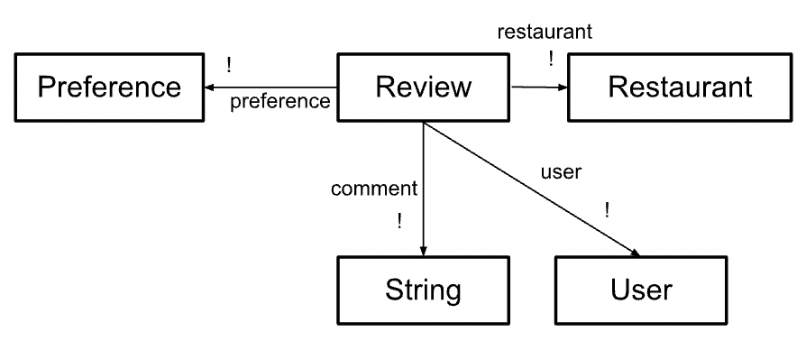

# Backend Design and Implementation for Omnom

## Links

You can find the code repository [HERE](https://github.com/irisxyang/backend-starter).

You can find the deployed service [HERE](https://backend-starter-gilt.vercel.app/).

## Beta Deliverables

### Design Reflection

#### Grouping Concept

The first challenge I encountered was when I was implementing the Grouping concept. Originally, I had one Grouping concept that would store an array of Restaurants. However, I found this to be extremely clunky in practice, as I was having to continuously pass back an array of Restaurant Object IDs back and forth throughout my code. The reason why this was such a difficult issue to tackle was because not only could groups have multiple restaurants in them, but restaurants could also be a part of multiple groups.

I ended up creating an entire new concept: GroupItem. I made the concept generic, since the idea of "grouping" is a very widely applicable concept. The way it works is that each instance stores a Grouping concept (which I simplified to just storing its associated creator and a name) and also stores an associated Item (Restaurant). Every time a new Restaurant is added to any group, a new instance is added to GroupItem with the Group and Restaurant ID. This allowed me to avoid clunky backend implementation practices.

#### Weighting Preferences and Review Preferences

The second challenge I encountered was when I was trying to implement the Preferences concept. Preferences is a group of set characteristics each assigned a score. From my A3 feedback, I realized it was very inefficient and not-rep-independent to be storing the preferences directly as metadata in my Weighting and Review concepts. In my previous implementation, both Review and Weighting stored these characteristics as state.

I decided to create a new concept, Preferences, which held these characteristics. The main issue I encounted after this was trying to figure out which concept should store the other. My initial thought was that backend implementation should be done from a bottom-up approach, which was why I initially tried to implement Preferences to store its associated Object. So, I would have Preferences [Object], and pass in either Weighting or Review depending on its function.

One thing that I did not realize would affect the implementation was the fact that I did not want the preferences to exist without its associated Object. This meant that a Preference was never created, retrieved, or deleted on its own--only if its associated Weighting or Review was also respectively changed. So, I ended up storing the Preference in Review and Weighting.

## Concepts (Modified From A3)

### Concept 1: Reviewing [User, Subject, Preferences]

- **Purpose:** Allows users to review a particular restaurant and assign a rating to attributes, and share to that user's friends' feeds. Attributes include ambience, food, service, price, and novelty, and are rated with a value from [-5 to 5], and the overall review rating is based on an average of these attributes.
- **Operational Principle:** If someone reviews a restaurant, then the review will be shared to their friends' feeds and the user can go back later to access that review on their own profile. If the review is deleted, then it will no longer show up on the app.
- **State:**
  - reviews: **set** Review
  - restaurant: reviews --> **one** Restaurant
  - user: reviews --> **one** User
  - comment: reviews --> **?** String
  - preferences: reviews --> **one** Preference
- **Actions:**
  - _add(res: Restaurant, pref: Preference, u: User, comment?: String, **out** review: Review)_ : create a review by a user for a restaurant, which includes a Preference concept that has scores for each attribute in the preference
  - _delete(rev: Review)_ : delete a review
  - _edit(old: Review, new: Review)_ : edit a review
  - _getReviewAttributeScore(rev: Review, attribute: Attribute, **out** score: Float)_ : gets the score of a certain attribute of a review
  - _getOverallRating(rev: Review, **out** rating: Float)_ : returns the overall rating of a review based on the individual attribute scores

## Alpha Deliverables

### Abstract Data Models

#### Concept 1: Reviewing

#### Concept 2: Authentication

#### Concept 3: Sessioning

#### Concept 4: Grouping

#### Concept 5: Restaurant

#### Concept 6: Following

#### Concept 7: Weighting

#### Concept 8: Preferences

- make reviewinc concept generic with respect ot subject of reviews
