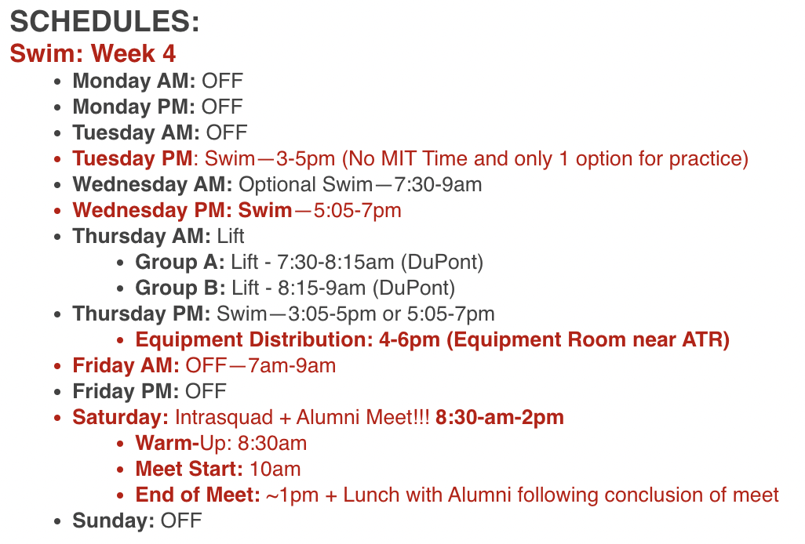
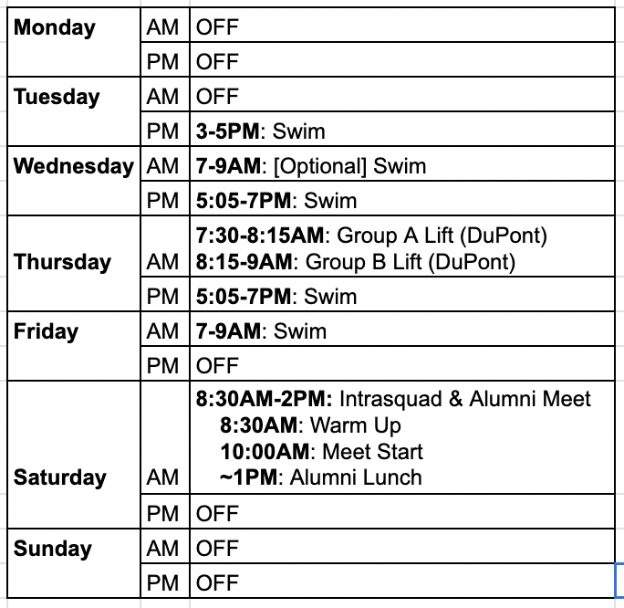
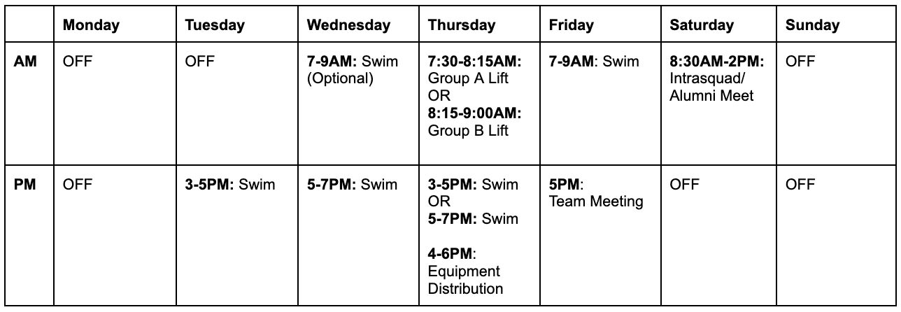

# User Interaction Design in Day to Day Life

In today's lecture, we expanded on the User Interaction design elements that we explored in our last lecture. Specifically, today's lecture focused a lot more on the Gestalt principles and variations on grouping components in intentional ways to convey structure, information, and meaning. Learning about these elements made me think of ways in my day to day life where my interaction (as a user) is affected by different design decisions.

As a member of the MIT Swimming and Diving team, our coach sends out a weekly email that details our weekly plan and schedule. In particular, something that has always bothered me has been the way that our coach presents the weekly schedule. Below is a screenshot of the schedule for this next week:

Based on the UI principles that we learned in lecture, there are a couple of critiques that I have for this design.

- Although each AM/PM specification is bulleted and bolded, there is no indication of grouping within each day. I would particularly like to see each day to be in the same visual "group". This could be done by adding extra line space between each day. This would make it easier for athletes to identify exactly what the plan is for each day, rather than having to search through the entire block of text just to find a specific practice slot, such as "Thursday PM".
- Since in English-speaking countries, we tend to move our eyes in the F-shaped pattern, this design is not particularly conducive to the most efficient way of conveying information. This means that people will tend to see schedule points for days earlier in the week more easily. However, there are many instances (such as in this example) where the important information is actually not in the beginning of the week. Instead, our coach attempts to use color in order to emphasize the important points (in red), but
- There is no usage of a clear structured layout. Instead of having to rely on different font decorations and colors in order to try and convey meaning and importance (which ends up appearing extremely cluttered), I would suggest using a layout where the information is grouped in columns and rows. This means that the user would be able to spend less time sorting information in their head, and instead easily intuitively categorize each event to its respective day.

Below are a couple of alternative designs I created to convey the same information. These options are by no means perfect, but in my opinion I think that they allow the user to more easily understand and reference the information that is trying to be conveyed.

Let me know if there are any other ways that you can think of to visualize this information so that users have a better time understanding it!
